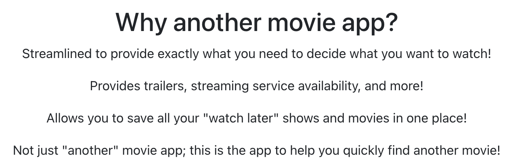
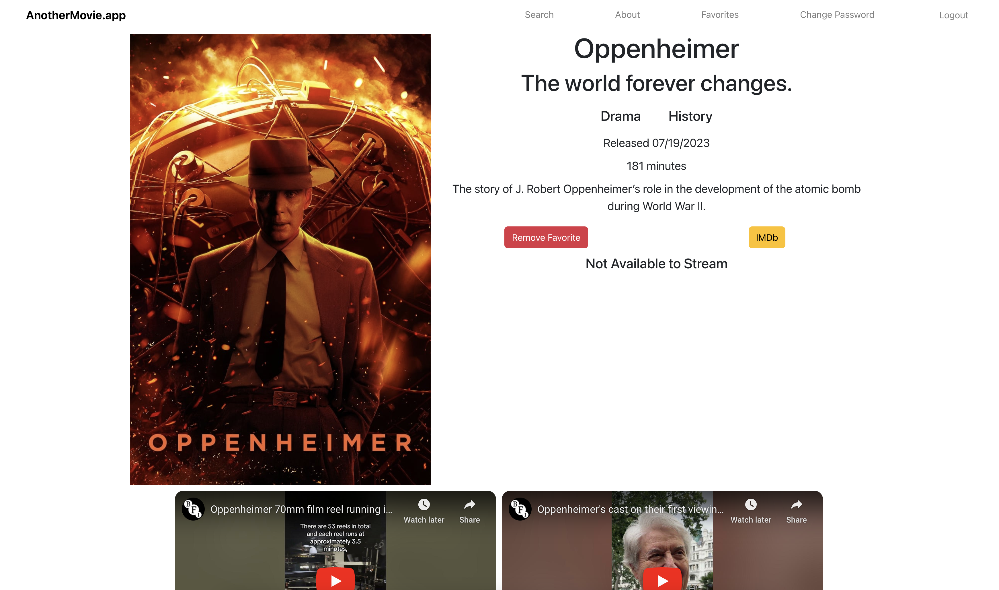
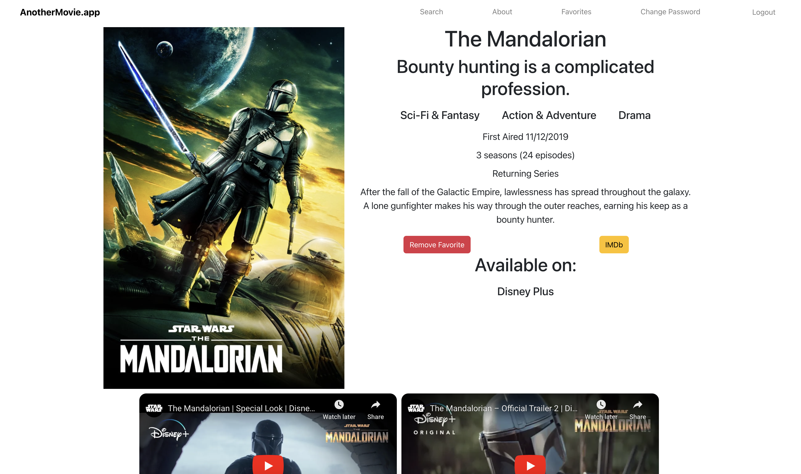
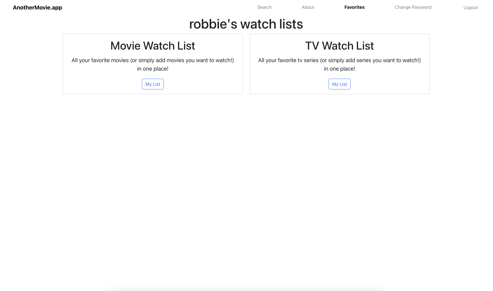
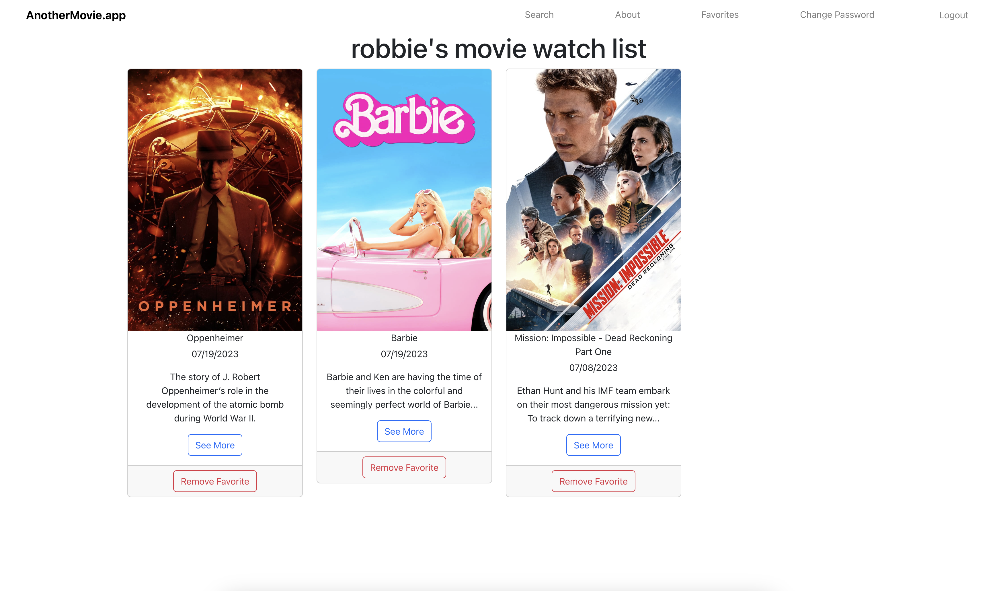
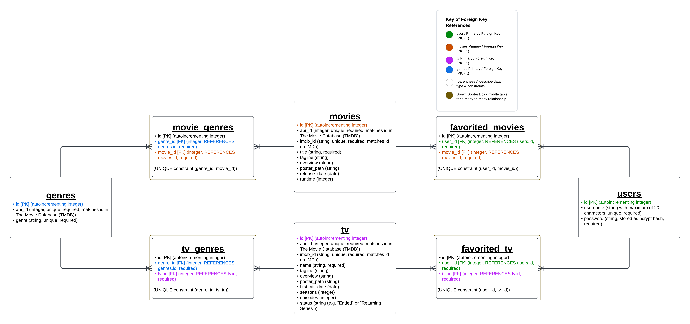

# AnotherMovie.app (Backend)

## Springboard Capstone Two

### James "Robbie" Gathje

Check out the site! [AnotherMovie.app](https://anothermovie.app)

Frontend code found [here](https://github.com/robbiegathje/movie-database-frontend).

## Overview

AnotherMovie.app is the go-to resource you need to find your next movie to watch or tv series to binge!

Providing search functionality:

And all the important details you want when finding new content: from streaming service availability to trailers and more!

Further, by creating an account, you're able to save those movies and tv series that you're interested in, no matter the streaming service, all in one place!

User Flow:

## Testing

Tests are found with the same name and alongside the files they are testing in their respective directories. All tests can be run from the command line in the root directory with:

`jest --runInBand`

or

`npm test` (shorthand for the same command)

## Technologies Used

* [The Movie Database](https://developer.themoviedb.org/docs)
* JavaScript
* React
* React Router
* Node.js
* Express.js
* PostgreSQL
* jsonwebtoken
* bcrypt
* Axios
* node-postgres
* HTML
* Reactstrap
* Bootstrap
* CSS
* Jest
* React Testing Library

Database Schema:

## Special Thanks

To TMDb for maintaining such a massive and reliable database of movie and tv data that this app would not survive without.

And to my wife, who supports me every step of the way, without whom I could do none of this. And an extra thanks for her help with design choices for all the apps I create!