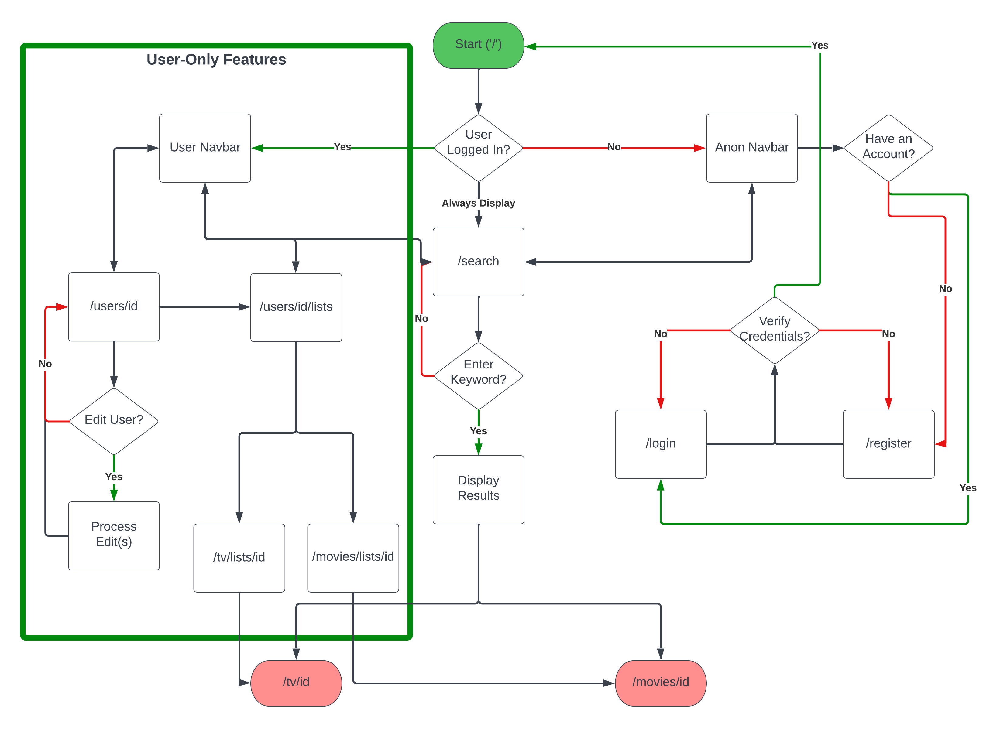

# Movie Database

## Capstone Two Proposal version 1.2

### James "Robbie" Gathje

Tech Stack: [The Movie Database](https://developer.themoviedb.org/docs), JavaScript, React, Node.js, Express.js

What is the project being proposed and why? 
The project being proposed is a movie database web-application (website) intended to equally demonstrate my front-end & back-end skills as a full-stack developer.

What goal is this website designed to achieve? 
The site is designed to be a quick-access catalogue for movies and tv series that a user may be interested in. It provides trailers, when there are any available, streaming platform availability, and general data a user would want when choosing something to watch. Further, it allows users to create a personalized tv watch list and a personalized movie watch list.

Who are its intended users (i.e. their demographics)? 
Film buffs, binge watchers, streaming savants, or anyone interested in knowing more about a particular tv series or movie they may be interested in watching. However, the app is only available in English, and the content it references is localized to the United States. Particularly, any reference to streaming service availability is a reference only to US availibility on that platform. Generally, the app is intended for the internet-centric generations of Gen Z and Millenials, approximately ages 13-43, but it could very well appeal more broadly, considering the vast, ageless appeal of television and movie content.

What data does it use? 
The app requires detailed movie and tv series data that includes: trailers, streaming service availability, plot overview, genres, movie runtime, number of seasons and episodes for tv series, and similar details. Additionally, the app requires users to register with a username and password in order to access personalized watch list features. Movie, TV, and all related data is acquired through [The Movie Database](https://developer.themoviedb.org/docs).

What does its database schema look like?

What kinds of issues might its API(s) cause? 
[The Movie Database](https://developer.themoviedb.org/docs) is very lightly rate limited (~50 requests per second), so it shouldn't be a major issue, but all code for the site needs to avoid making API calls in large batches.

What sensitive information does it secure? 
Passwords are secured and must be properly encrypted. Usernames are also secured. However, usernames are never public, as there is no social functionality in the base app.

What functionality does it include?

1. User Registration, Security, and Authorization - login/logout
2. Customizable Watch Lists - users are enabled to create both a movie watch list and a tv watch list for quick access to those movies'/series' pages.
3. Movie & TV Information & Trailers Database - provide trailers, streaming service availability, and general information for any movie or tv series

What does its user flow look like?

What features does it have beyond basic CRUD (Create, Read, Update, Delete)? 
The base version of the app is built on user-customized watch lists of movies and tv series.

What stretch goals / extra features could be achieved / implemented? 
There are four stretch goals.

1. New & upcoming releases
2. Theatre showtimes
3. Allow users to store which streaming services they subscribe to and prominently display whether or not they are presently able to stream any particular movie or tv series they are searching for.
4. Detailed actor, writer, and director pages